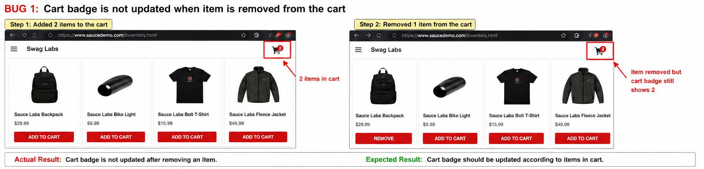
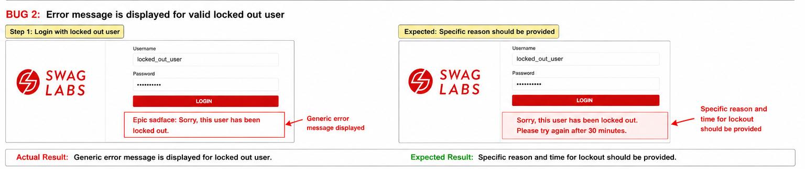

# SauceDemo Bug Testing Project

## 📌 Project Description

Performed manual testing on SauceDemo website and identified functional and UI bugs.

## 🛠️ Key Work

* Designed and executed test cases
* Identified bugs in cart, login, sorting, and logout modules
* Captured screenshots as proof

## 🔧 Tools Used

* Manual Testing
* MS Excel / Word

## 🐞 Bugs Identified

1. Cart badge not updating
2. Login error message issue
3. Sorting (Z to A) not working
4. Add to cart button issue
5. Logout not working

## 📸 Screenshots

### Bug 1 - Cart Issue

### Bug 2 - Login Issue

### Bug 3 - Sorting Issue

### Bug 4 - Add to Cart Issue

### Bug 5 - Logout Issue

